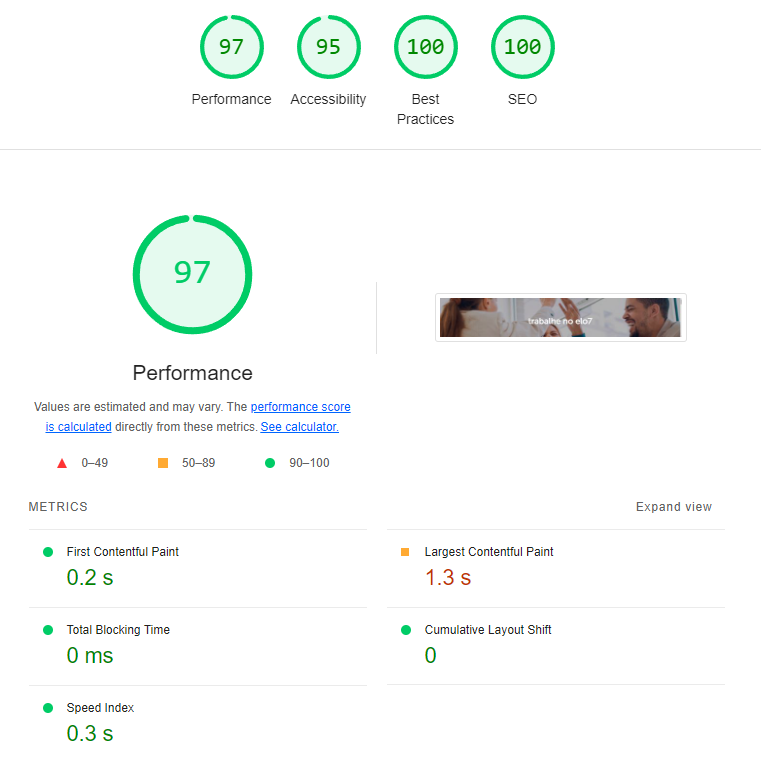

# Elo7 Dev Challenge

Esse é um teste técnico para a empresa Elo7. O objetivo foi replicar uma tela que contendo um resumo sobre o Elo7, como é trabalhar na empresa, alguns depoimentos e cultura da empresa, além de conter uma listagem dinâmica das vagas em aberto.

## Lógica da Aplicação e funcionalidades

A aplicação é composta por algumas seções estáticas e uma seção dinâmica de lista de vagas ```<JobsList />```, na qual são obtidos os dados através de API.

```
export default function HomePage() {
  return (
    <main className="flex min-h-screen flex-col">
      <Header />
      <HeroDescriptionSection />
      <ReviewSection />
      <TeamSection />
      <BenefitsSection />
      <ServiceImageSection />
      <JobsList />
    </main>
  );
}
```

## Montagem de Dados a partir de Requisições API

Este projeto utiliza requisições a um servidor local como BFF para buscar e montar dados para a renderização do componente de lista de vagas dentro da aplicação.

O componente ```<JobsList />``` obtém a lista de vagas através da função ```getJobsList``` e passa esses dados para o componente ```<JobsDataTable />```, que exibe e filtra as vagas. O usuário pode buscar vagas pelo título, e a tabela é atualizada dinamicamente conforme os filtros são aplicados.

## Como executar o projeto

### Pré-requisitos

Antes de começar, você vai precisar ter instalado em sua máquina as seguintes ferramentas:
[Git](https://git-scm.com), [Node.js](https://nodejs.org/en/).
Além disto é bom ter um editor para trabalhar com o código como [VSCode](https://code.visualstudio.com/)

#### 🧭 Rodando a aplicação web (Frontend)

```bash

# Clone este repositório
$ git clone git@github.com:mateusbirtann/elo7-dev-challenge

# Acesse a pasta do projeto no seu terminal/cmd
$ cd elo7-dev-challenge

# Instale as dependências
$ pnpm install

# Execute a aplicação em modo de desenvolvimento
$ pnpm run dev

# Cria o bundle para publicação
$ pnpm run build

# Execute a aplicação em modo de produção
$ pnpm run start

# Executa o conjunto de testes disponível na aplicação
$ pnpm run test


# A aplicação será aberta na porta:3000/ em desenvolvimento e produção. Acesse http://localhost:3000/
```

#### 🧭 Rodando o servidor local (Backend)

```bash
# Navegue até a pasta do servidor dentro do projeto:
$ cd server

# Instale as dependências do projeto
$ pnpm install

# Inicie o servidor executando o seguinte comando:
$ pnpm dev

# A aplicação será aberta na porta:3333
```

#### 🐳 Rodando o servidor com Docker

```bash
# Navegue até a pasta do servidor dentro do projeto:
$ cd server

# Construa a imagem Docker:
$ docker build -t nome-da-imagem .

# Inicie os containers usando o Docker Compose:
$ docker-compose up

# O servidor estará disponível na porta:3333

```

## ⚙️ Configuração de Ambiente

Para configurar as variáveis de ambiente, crie um arquivo `.env` na raiz do projeto. Aqui está um exemplo de configuração:

```env
API_URL=http://localhost:3333
```

## 🛠 Estrutura de pastas

```
project/
├── app/
├── components/
├── types/
├── tests/
├── data/requests/
└── other_files/
```

- app/: A estrutura App Router é a versão mais recente que permite usar os novos recursos do Next/React, como server componentes e streaming.
- components/: Contém componentes reutilizáveis ​​que são usados ​​em várias partes do aplicativo
- types/: Contém definições de tipos de dados personalizados usados ​​no aplicativo. Essas definições ajudam a garantir a consistência e a precisão dos dados manipulados pelo aplicativo, além de facilitar o desenvolvimento, fornecendo informações sobre a estrutura dos objetos de dados.
- tests/: Contém os testes automatizados para as diversas partes do aplicativo.
- lib/: Contém bibliotecas de código que são usadas em todo o aplicativo. Estas podem ser bibliotecas de terceiros ou bibliotecas personalizadas desenvolvidas especificamente para este projeto.
- data/request: Contém funções para realizar requisições a APIs externas

## 🛠 Tecnologias

As seguintes ferramentas foram usadas na construção do projeto, incluindo testes e setup.

#### **Website**

- **[Next.js](https://nextjs.org/)** - Framework React para renderização do lado do servidor e geração de sites estáticos.
- **[Tailwind](https://tailwindcss.com/)** - Estrutura CSS de baixo nível que permite estilo direto na marcação.
- **[Radix UI](https://www.radix-ui.com/)** - Biblioteca de componentes de código aberto otimizada para desenvolvimento rápido, fácil manutenção e acessibilidade.
- **[Eslint](https://eslint.org/)** - Ferramenta de linting que ajuda a detectar erros e problemas no código.
- **[Typescript](https://www.typescriptlang.org/)** - Superconjunto de JavaScript que adiciona tipagem estática e outros recursos.
- **[Jest](https://jestjs.io/pt-BR/)** - Framework de teste em JavaScript para testes unitários, integração e snapshot.
- **[Prettier](https://prettier.io/)** - Ferramenta de formatação de código que ajuda a manter um estilo consistente e legível.
- **[Lucide React](https://lucide.dev/)** - Conjunto de ícones leves e personalizáveis para projetos React.

## ⚡ Performance

Utilizando a ferramenta [Lighthouse](https://developers.google.com/web/tools/lighthouse), podemos avaliar e melhorar a qualidade da nossa aplicação web. O Lighthouse é uma ferramenta open-source automatizada que audita a performance, acessibilidade, práticas progressivas da web, SEO e mais.

Aqui estão os resultados do Lighthouse na última versão do projeto:

### Desktop


